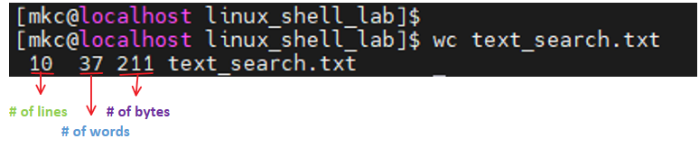

# Filters / Text Processor Commands

## Table of Contents

|  [`cut`](#cut)  |  [`awk`](#awk)  |  [`grep/egrep`](#grep)  |  [`sort/unique`](#sortunique)  |  [`wc`](#wc)

----

## cut

> allows you to **cut** parts of lines from specified files or piped data and print the result to standard output.
>
>it can be used to cut parts of a line by **delimiter** , **byte position** and **charecter**

<ins>***Examples:-***</ins>

* cut <<file_name>> = doesnot work. throws error. atleast you need to provide options.
    >
    Ex:-
        $> cut text_search.txt =  throws **cut: you must specify a list of bytes, characters, or fields** 

* cut --version or cut --help or man cut

* cut -c1 <<file_name>> = **gives 1st charecter in each line**
    >
    Ex:-
         $> cut -c1 text_search.txt

* cut -c1,3,5 <<file_name>> = **gives 1st,3rd,5th charecters in each line**
    >
    Ex:-
        $> cut -c1,3,5 text_search.txt

* cut -c1-5 <<file_name>> = **gives range of charecters in each line**
    >
    Ex:-
        $> cut -c1-5 text_search.txt

* cut -c1-2,5-9 <<file_name>> = **gives specific range of charecters in each line**
    >
    Ex:-
        $> cut -c1-3,5-9 text_search.txt

* cut -c1-2,5-9 <<file_name>> = **gives specific range of charecters in each line**
    >
    Ex:-
        $> cut -c1-3,5-9 text_search.txt

* cut -d: -f 6 <<file_name>> = **list 6th field separated by  ***':'*****
    >
    Ex:-
        $> cut -d: -f 6 /etc/passwd

* cut -d: -f 6-7 <<file_name>> = **list 6th&7th field separated by   ***':'*****
    >
    Ex:-
        $> cut -d: -f 6-7 /etc/passwd

* ls -l | cut -c2-4 = **print user permission of files/dir**
    >
    Ex:-
        $> ls -l | cut -c2-4

## awk

> awk is utility designed for data extraction.

<ins>***Examples:-***</ins>

* $> awk --version   =   to check awk version
* $> awk "{print $1}" awk_lab.txt =  gives only 1st field columns data
* $> ls -l | awk '{print $1,$3}'   = list 1st and 3rd fileds of ls -l output
* $> ls -l | awk '{print $NF}'   = last filed of ls -l output
* $> awk '/Krishna/ {print}' awk_lab.txt (or) awk '/2022/ {print}' awk_lab.txt =  search for a specific word
* $> awk -F: '{print $1}' /etc/passwd = output only 1st field of /etc/passwd (delimiter : or split by : and give 1st field)
* $> echo "Hello World" | awk '{$2="krishna"; print $0}' = replace words field words
* $> awk '{$2="Maddur"; print $0}' awk_lab.txt =  same as above
* $> awk 'length($0)>20' awk_lab.txt = get lines that have morethan 20 byte size
* $> ls -l | awk '{if($9 == 'awk_lab.txt'); print $0}' - get the field matching awk_lab.txt in pwd
* $> ls -l | awk '{print NF}' or awk '{print NF}' awk_lab.txt - no of fields

## grep

> stands for global regular expression print. processes text line by line and prints any lines which match a specified pattern.

       Ex:-
            $> grep --version or grep --help
            
            $> grep <<keyword>> <<file>>    = search for a keyword from a file
                  
                  Ex:- grep Journey text_search.txt = shows the lines from a file which contains Journey word. 
                       grep mkc /etc/passwd
            
            $> grep -c <<keyword>> <<file>> = search for a keyword and display count
                  
                  Ex:- grep -c learning text_search.txt  
            
            $> grep -i <<keyword>> <<file>> = search for keyword ignore case-sensitive
                  
                  Ex:- grep -i journey text_search.txt
            
            $> grep -n <<keyword>> <<file>> = displays matched lines and their line no's.
                  
                  Ex:- grep -n journey text_search.txt
                       grep -in journey text_search.txt

            $> grep -v <<keyword>> <<file>> = displays every thing except macthed keyword lines
                  
                  Ex:- grep -v journey text_search.txt

            $> grep <<keyword>> <<file>> | awk '{print $1}'= search for keyword and then retun 1st field
                  
                  Ex:- grep journey text_search.txt | awk '{print $1}'

            $> ls -l | grep Desktop  = search for keyword on 1st command output

            $> egrep -i "<<keyword1>>|<<keyword2>>" <<file>> = search one or more keywords

                  Ex:-  egrep -i "journey|to" text_search.txt

## sortunique

> **sort** command sorts alphabetical order
>
> **uniq** command filters out the repeated or duplicate lines

<ins>***Examples Sort:-***</ins>

* sort --version or sort --help or man sort

* sort <<file_name>> = **sort based on 1st col,1st char content of charecter alphabetical order(A-Z/a-z)**
    >
    Ex:-
        $> sort text_search.txt

* sort -r <<file_name>> = **sort content of charecter reverse order**
    >
    Ex:-
        $> sort -r text_search.txt

* sort -k2 <<file_name>> = **sort based on 2ndcol,1st char**
    >
    Ex:-
        $> sort -k2 text_search.txt

* sort -k2 <<file_name>> = **sort based on 2ndcol,1st char**
    >
    Ex:-
        $> sort -k2 text_search.txt

<ins>***Examples Uniq:-***</ins>

> ***Note:-***
> ***always need to use sort command before using uniq command***

* sort <<file_name>> | uniq  = **sort the file content and removes duplicates lines**
    >
    Ex:-
        $> sort text_search.txt | uniq

* sort <<file_name>> | uniq  -c = **sort first then uniq and list count repeated times reach line**
    >
    Ex:-
        $> sort text_search.txt | uniq -c

* sort <<file_name>> | uniq  -d = **show only repeated lines** or **show only repeated lines and count**
    >
    Ex:-
        $> sort text_search.txt | uniq -d or sort text_search.txt | uniq -dc

* Ex:- ls -l | awk ' NR>1 {print $8}' | sort | uniq -c

## wc

> reads either standard input or alist of files and generate: **newline count, word count and btye count**

> ***Note:-***
> ***wc command will not work on directories and it will not print no information abt directory***

<ins>***Examples:-***</ins>

* wc --version or sort --help or man sort

* wc <<file_name>> = **displays word count information of file**
    >
    Ex:-
        $> wc text_search.txt

* wc -l <<file_name>> = **# of lines in a file**
    >
    Ex:-
        $> wc -l  text_search.txt

* wc -w <<file_name>> = **# of words in a file**
    >
    Ex:-
        $> wc -w  text_search.txt

* wc -c <<file_name>> = **# of bytes in a file**
    >
    Ex:-
        $> wc -c  text_search.txt

* wc -m <<file_name>> = **# of chars in a file**
    >
    Ex:-
        $> wc -m  text_search.txt

* ls -l | wc -l  = **print # of files from ls -l output**
    >
    Ex:-
        $> ls -l | wc -l

* grep <<key_word>> <<file_name>> | wc -l  = **print matched keyword # of lines**
    >
    Ex:-
        $> grep learning text_search.txt | wc -l
