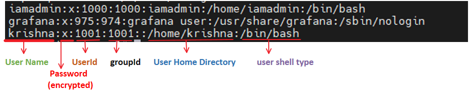
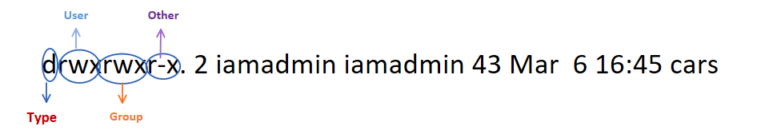
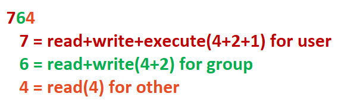

# Intermediate Commands

## Table of Contents

| [`shellprompt`](#shellprompt) | [`aliases`](#aliases) | [`printenv`](#printenv) | [`env`](#env) | [`chmod`](#chmod) | [`chown`](#chown) | [`acl`](#acl) | [`vi`](#vi) | [`vim`](#vim) | [`sed`](#sed) | [`systemctl`](#systemctl) | [`ps`](#ps) | [`top`](#top) | [`kill`](#kill) |

## User Account Management - Commands

| [`useradd`](#useradd) | [`groupadd`](#groupadd) | [`userdel`](#userdel) | [`groupdel`](#groupdel) | [`usermod`](#usermod) |

### created user record managed in below files

* /etc/passwd

* /etc/group
* /etc/shadow
* /etc/login.def - file is used to enabling password aging

-----

## shellprompt
    > 
        Use an environment varible to customize
        - bash, ksh and sh use $PS1
        - csh, tcsh and zsh use $prompt
        Ex:
            - to check current shell prompt format 
                Ex: 
                    $> echo $PS1  
                        current format: [\u@\h \W]\$     
                        value: 
                            [iamadmin@localhost ~]$
                            [iamadmin@localhost log]$ - if we are in /var/log folder
            -  Temporary(current running session)
                Ex:
                    $> PS1="[\t \u@\h \w>]\$"  old value
                        format: [\t \u@\h \w>]\$
                        value:
                            [18:25:04 iamadmin@localhost ~>]$ 
                            [18:25:25 iamadmin@localhost /var/log>] - if we are in /var/log folder

            - to make persist permanently(use any editor to edit, iam using vi) after that run source ~/.bash_profile or . ~/.bash_profile to reload profile
                Ex:
                    $> vi .bash_profile and insert below line and save and close
                        PS1="[\t \u@\h \w>]\$" 
                                OR
                        echo 'export PS1="[\t \u@\h \w>]\$"' >> ~/.bash_profile        

## aliases
    >  
        shrotcuts
        use for long commands
        use for commands you often type
        
        ### Temporary(current running session)
            - Viewing Alias
                Ex:
                    $> alias - displays list of alias defined.
            - Creating/Updating Aliases
                alias [name[=value]] - list or create aliases
                - use name=value to create a new alias
                Ex:
                    $> alias cls='clear' - create as alias for clear. now you can use cls instead of clear
                    $> alias lltr='ls -ltr' - now you can use lltr instead of long command as ls -ltr
            
            - Removing Aliases
                unalias name  - remove the "name" alias
                unalias -a   - remove all aliases
                Ex:
                    $> unalias cls - will remove cls alias we created earlier

         ### Persisting Aliases
            - add aliases to your personal initialization files(.bash_profile)

            Ex:- vi ~/.bash_profile and insert below lines after that run source ~/.bash_profile or . ~/.bash_profile to reload profile
                alias lltr="ls -ltr"
                alias cls="clear"

## printenv

    >  
        used to print the values of environment variables

        ### Temporary(current running session)
            - Viwewing environment varible
                Syntax: printenv [environment varible name]    
                    Ex:
                        $> printenv  - displays list of environment varible defined
                        $> printenv PWD - display value for environment variable PWD

## env
    >  
        name/value pair

        ### Temporary(current running session)
            - Viwewing environment varible
                Syntax: printenv [environment varible name]    
                    Ex:
                        $> env   - displays list of environment varible defined

            - creating/updating environment varible 
                Syntax: export <<varible_name>>="<<value>>"
                    Ex:
                        $> export EDITOR="vi"
                        $> export TZ="US/Pacific"

            - removing environment varible 
                Syntax: unset <<varible_name>>
                    Ex:
                        $> unset TZ
        
        ### Persisting environment varible
            - add environment variabled to your personal initialization files(.bash_profile)

            Ex:- vi ~/.bash_profile and insert below lines after that run source ~/.bash_profile or . ~/.bash_profile to reload profile
                 export EDITOR = "vi"

## chmod

### File and Directory Permission

    there are 3 types of permissions

| Symbol | Permission     |
| :---:  | :---:          |
|   r    |  read          |
|   w    |  write         |
|   x    |  execute       |

    each permission(rwx) can be controlled at three levels/categories

| Symbol | Category                             |
| :---:  | :---                               |
|   u    |  user                                |
|   g    |  group                               |
|   o    |  other(everyone on the system)       |
|   a    |  all                                 |

    - run below command to get permission of File or Directory
        Ex:

            $> ls -l
            drwxrwxr-x. 2 iamadmin iamadmin 43 Mar  6 16:43 fruits
            -rw-rw-r--. 1 iamadmin iamadmin  0 Mar  7 21:15 test.txt 

| Symbol | Type           |
| :---:  | :---:          |
|   -    |  regular file  |
|   d    |  directory     |
|   l    |  symbolic link |
|   c    |  special file or device file |
|   s    |  socket |
|   p    |  Named pipe |
|   b    |  Block device |

### permission on File and Directory

| Permission | File                                                                    |  Directory                                         |
| :---       | :---                                                                    |  :---                                              |
|  Read(r)   |grants the right to read the contents of the file                        |ability to list all the files in the directory      |
|  Write(w)  |ability to change the contents of the file                               |create new files in the directory                   |
|  Execute(x)|right to execute them, if they are programs (Files that are not programs should not be given the execute permission)                                                                            |allows you to enter the directory(cd)               |

### assign permission using letters

| Item   | Meaning                          |
| :---   | :---                             |
| chmod  |  change mode command             |
| ugoa   |  category(user, group,other,all) |
| +-=    |  add,subtract,set permission     |
| rwx    |  read,write,execute              |

>
    Ex:
        $> chmod g+w test.txt - add write permission to group category
        $> chmod g-w test.txt - remove write permission to group category
        $> chmod g+wx test.txt - add write and execute permission to group category
        $> chmod u+rwx,g-x test.txt - add r,w,x to user and remove execute to group 
        $> chmod a=r test.txt - user,group,other set to read permission
        $> chmod u=rwx,g=rx,o= test.txt -user(read,write,execute),group(read,execute),other(no permission)

### assign permission using Numeric Mode

| r       | w      | x    | Meaning                 |
| :---:   | :---:  |:---: | :---                    |
| 0       |  0     | 0    | value for off           |
| 1       |  1     | 1    | binary value for on     |
| 4       |  2     | 1    | base 10 value for on    |

### stick to order

|           |    U     |     G   |    O   |
| :----     |  :-----: |  :----: | :----: |
| Symbolic  |  rwx     |   r-x   | r--    |
| Binary    |  111     |   101   | 100    |
| Decimal   |   7      |    5    |  4     |

### Commonly Used Permission

| Symbolic          | Octal |
| :---              | :---  |
| rwx------         |  700  |
| rwxr-xr-x         |  755  |
| rw-rw-r--         |  664  |
| rw-rw----         |  660  |
| rw-r--r--         |  644  |

>
    $> chmod 764 test.txt

## chown

### File and Directory Ownership

>
    - There are 2 owners of a file and directory
        user and group
    
    - command to change file ownership
         chown - changes the ownership of a file 
         chgrp - changes the group ownership of a file
    
    - recursive option using  -R 

    - to use chown, you need to have sudo/root permission.

>
    - changing ownership(user) of a file/directory
        Ex:
            $> chown root mylocal - it will change user from iamadmin to root user.
            Before : drw-------. 4 iamadmin iamadmin 48 Mar  7 21:15 mylocal 
            After  : drw-------. 4 root     iamadmin 48 Mar  7 21:15 mylocal

    - changing ownership(group) of a file/directory
        Ex:
            $> chgrp root mylocal - it will change group from iamadmin to root.
            Before : drwx------. 4 root     iamadmin 48 Mar  7 21:15 mylocal
            After  : drwx------. 4 root     root     48 Mar  7 21:15 mylocal

## acl

### Access Control List

>

    - additional, more flexiable permission mechanism for file systems.
    - allows you to give permission for any user or group to any disc resource.
    - more fine-grained access rights for files and directories.
    - commands to assign and remove ACL permissions are: `setfacl` and `getfacl`
    - As you assign the ACL permission to a file/directory it adds + sign at the end of the permission

    - usecase
    user is not a member of group created by you but still you want to give some read or write access, how can you do it  
    without making user a member of group.

    - to add permission for user
        Ex:
            $> setfacl -m u:<<username>>:rwx <<path to file>>

    - to add permission for group
        Ex:
            $> setfacl -m g:<<username>>:rw <<path to file>>

    - to allow all files and directories to inherit from directory it is within
        Ex:
            $> setfacl -Rm <<entry>> <<path to file>> 
                    <<entry>> - user/group permission entry
    
    - to remove a specific entry
         Ex:
            $> setfacl -x u:<<username>> <<path to file>> (for a specific user)
            $> setfacl -b  <<path to file>> (for all user)

    - to get more details abt file/directory
        Ex:
            $> getfacl <<path to file>>

## vi

>
    - visual editor is program which enables you to create and manipulate data(text) in a Linux file
    
    - vi supplies commands for:
        - inserting and deleting text
        - replacing text
        - moving around file
        - finding and substituting strings
        - cutting and pasting text

### below are most commenly used keys

| Keys    | Purpose |
| :---:   | :---  |
| i       |  insert mode |
| Esc     |  escape out of any mode  |
| r       |  replace mode  |
| d(2 times)       |  delete mode  |
| :q!     |  quit without saving  |
| :wq!    |  quit and save  |
| x       |  delete char by char  |
| u       |  undo changes  |
| o       |  new line and enter into insert mode  |

## vim

>
    - vim editor is advanced than vi. much easier to use. extra added features compared to vi
    
    - vim features:
        - completion
        - spell check
        - comparision
        - merging
        - regex
        - syntax heighting e.t.c
    
    - to practise vim editor please refer 
            https://www.openvim.com/   
            http://www.vimgenius.com/   
            https://vim-adventures.com/

## sed

* replace s string in a file with a new string
* find and delete a line
* remove empty lines
* remove first or n lines in a file
* to replace tabs with spaces
* show defined lines from a file
* substitute within vi editor and much more...

>
  Ex:-
        $> sed 's/abt/about/g' myfirstvimfile

             - s means substitute
             - abt/about/g -  will substitue abt string to about string in global means all places
             - this only display the changes in console but it will not do changes in file
        
        $> sed -i 's/abt/about/g' myfirstvimfile
             
             - -i - it will make changes in file as well.

        $> sed 's/journey//g' myfirstvimfile

             - journey//g -  it will remove journey string(case sensitive)

        $> sed '/about/d' myfirstvimfile

             -  /about/d -  it will remove the lines which contains about string

        $> sed '/^$/d' myfirstvimfile

              - /^$/d -  deletes empty lines

        $> sed '1d' myfirstvimfile
            
              - '1d' - delete the first line

        $>  sed '1,2d' myfirstvimfile
          
              - '1,2d' -  delete line no 1 and 2 

        $> sed -i 's/\t/  /g' myfirstvimfile

              - s/\t/  /g -  replace tabs with spaces
              - s/ /\t/g  -  replace spaces with tabs

        $> sed -n 4p myfirstvimfile

              - -n 4p - to display 4th line inside a file
              - -n 4,8p -  to display 4th to 8th lines inside a file(include)

        $> sed 4,6d myfirstvimfile
          
              -  4,6d - displays all lines except from line no 4 to 6.

        $> sed G myfirstvimfile

              -  G - after each and every file it will insert new empty line

        $> sed '4!s/abt/about/' myfirstvimfile

              -  4!s/abt/about/ - will replace abt string with about in all lines which contains abt string except 4th line

        $> in vi editor :%s/abt/about/ - will replace abt with about string in vi editor

## systemctl

>

* used to control system services

`Syntax:-`
    systemctl  start|stop|status  servicename.service -  to start/stop the service or to check the status of the service
    systemctl enable|disable servicename.service - to enable/disable service to start at boot time
    systemctl restart/reload servicename.service - to restart/reload the service when configuration changes
    systemctl list-units --all -  to display all active/inactive list of services. remove --all to see only active services

    Ex:-

       $> systemctl status firewalld.service -  to check the firewalld service status.

* to add service(3rd party) under systemctl management

  create a unit file in /etc/systemd/system/servicename.service

* control system systemctl

   systemctl poweroff
   systemctl halt
   systemctl reboot

## ps

>
  stands for process status and it displays all the currently running processes in the linux system

  Ex:-
        $> ps - shows the processes of the current shell
          O/P:
                PID - the unique process id
                TTY - terminal type that the user logged-in to
                TIME - amount of CPU in mins and seconds that the process has beeen running
                CMD - name of the command

        $> ps -e - shows all running processes
        $> ps aux = shows all running processes in BSD format. 
        $> ps -ef = shows all running process in full format listing (widely used command)
        $> ps -u <<username>> - shows all processes by username

## top

>
* top command is used to show the linux processes and it provides a realtime view of the running system
* shows the summary informtion of the system and list of processes/threads which are currently managed by the linux kernel
* it goes into interactive mode and hitting q to exit

   Ex:-

        $> top
        $> top -u <<username>> =  shows tasks/processes owned by username
        $> top then press c = shows command absolute path of the command
        $> top then press k = kill the process by PID within top session
        $> top then M and p = to sort all processes by memory usage

`Note:-`
        - top command refreshes the information every 3 seconds by default

## kill

>
* kill command is used to terminate processes manually
* it sends a singnal which ultimately terminates or kills a perticular process or group of processes

`Syntax:-`

      kill [OPTION] [PID]

      OPTION = singnal name or singnal number/ID
      PID = process Id

      Ex:-
            $> kill -l = to get a list nof signal names/numbers

### Most used signals

| Singnals    | Purpose |
| :---        | :---  |
| kill PID    |  kill process with default signal |
| kill -1     |  restart  |
| kill -2     |  interrupt from the keyboard just like Ctrl+C  |
| kill -9     |  forcefully kill the process  |
| kill -15    |  kill a process gracefully  |

* Other similar kill commands

    killall - kill all the process and its related child processes. 
    pkill - kill by the process name.

## useradd

> used to create the user.

    Ex:- 
        $> useradd krishna -  it will create user called krishna
        $> id krishna - to verify weather user created or not. if yes it will return user information like uid,gid and e.t.c
        $> useradd -g india-org -s /gin/bash -c "user description" -m -d /home/ksuresh sureshk

## groupadd

> used to create group

    Ex:- 
        $> groupadd india-org -  it will create group called india-org
        $> cat /etc/group - to verify weather group created or not

## userdel

> used to delete the user

    Ex:-
        $> userdel -r spiderman - delete the user along with user home directory as well

## groupdel

> used to delete the group

    Ex:- 
        $> groupdel india-org -  it will delete group called india-org
        $> cat /etc/group - to verify weather group created or not

## usermod

> useed to modify user account

    Ex:-
        $> usermod -G india-org krishna -  add krishna to india-org group
        $> grep krishna /etc/group - to verify abt group info
        $> chgrp -R india-org /home/krishna - to change user home directory groupname to india-org
