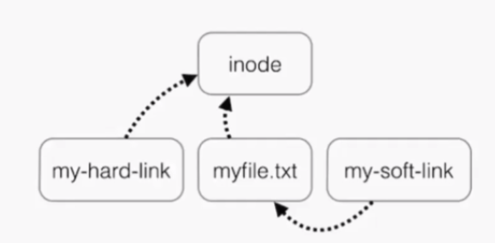

# Basic Commands - Part01

## Command Syntax

> command [options] [arguments]

## Table of Contents

|  [`help`](#help)  | [`man`](#man) |  [`who`](#who) | [`whoami`](#whoami) | [`uname`](#uname) |
[`pwd`](#pwd) | [`basename`](#basename)| [`history`](#history) |  [`ls`](#ls) | [`cd`](#cd) |
[`touch`](#touch) | [`cp`](#cp) | [`mv`](#mv) | [`mkdir`](#mkdir) | [`rm`](#rm) | [`find`](#find) | [`locate`](#locate) | [`passwd`](#passwd) | [`wildcards`](#wildcards) | [`ln`](#ln) |

-----

## help

    >  there are 3 types of help commands
        - whatis command  - give you quicker/shoter info abt command
        - command --help  - little more details 
        - man command     - complete list of command information

        Ex:
            $> whatis ls
            $> ls --help
            $> man ls

## man
    > 
        I don't know how to use a command, I type man <command_name> to get manual of the command
            Ex:
                $> man ls
                $> man cat

## who
    > 
        - The who command displays the users logged in to the system.
            Ex:
                $> who
        - -aH flags will tell who to display more information, including the idle time and the process ID
            Ex:
                $> who -aH

## whoami
    >
        - whoami to print the user name currently logged in to the terminal session
            Ex:
                $> whoami

## uname
    >
        - uname without any options will return the Operating System codename
            Ex: 
                $> uname

        - The a option prints all the information
            Ex: 
                $> uname -a

        - The s option prints the Operating System name. r prints the release, v prints the version
            Ex: 
                $> uname -srv

        - The a option prints all the information
            Ex: 
                $> uname -a

## pwd
    >
        - pwd command to know where you are, It will print the current folder path(full path).
            Ex: 
                $> pwd

## basename
    >
        - The basename command strips any leading directory and trailing suffix from the name.
            Ex: 
                $> basename /usr/local/
                $> basename /usr/local

        - The below example shows how to use the basename command inside a bash for loop to rename   
        all files ending with “.jpeg” in the current directory by replacing the file extension
        from “.jpeg” to “.jpg”:

                for file in *.jpeg; do
                    mv -- "$file" "$(basename $file .jpeg).jpg"
                done

## history
    >
        -  inside .bash_history file

        - Every time we run a command, that's memorized in the history, This shows the history with numbers
            Ex: 
                $> history

        - The c option is used to clear the history. 
            Ex: 
                $> history -c

        - You can combine this with grep to find a command you ran:
            Ex: 
                $> history | grep uname

## ls

    > Inside a folder you can list all the files that the folder contains
            Ex:
                $> ls - current location listing
                $> ls /bin - bin folder listing
                $> ls -l - long listing
                $> ls -1 - each file name with new line
                $> l. - hidden files
                $> ls -a - display all file names including hidden files 

## cd

    > you can move into a folder. cd means change directory
            Ex:
                $> cd fruits - will move into fruits folder
                $> cd .. - one folder back
                $> cd . - nothing happen. it will stay into current folder
                $> cd /etc - using this absolute path starts from root folder and move into etc folder
                $> cd ../fruits - it will go one folder back and move to mentioned folder here fruits
                $> cd ~ or cd  - it will go to user home directory
                $> cd -   -- it will go to prev directory from where you came

## touch

    >
       - creating empty file
          Ex:
               $> touch test.txt - creates empty file.
               $> touch test1.txt test2.txt - creates multiple empty files 
        - If the file already exists, it opens the file in write mode and the timestamp of the file is updated.   

## cp

it will copy file/directories in source path and to destination path like `copy and paste`

    >
        - you can create a file with same content of file
        - using this command you can copy a file.
            Ex: 
                $> cp test.txt test-temp.txt 

        - To copy folders you need to add the -R
            Ex:
                $> cp -R fruits cars

## mv

it will delete file/directories in source path and move to destination path like `cut and paste`

    >

        - Using this command once you have a file, you can move it around. You specify the file current path, and its new path:
            Ex: 
                $> mv pear new_pear -  The pear file is now moved to new_pear . This is how you rename files and folders.

        - If the last parameter is a folder, the file located at the first parameter path is going to be moved into that folder.
           Ex:
                $> mv pear apple fruits -  pear and apple moved to the fruits

## mkdir

    > You create folders using the mkdir
            Ex:
                $> mkdir fruits - will create folder in current directory
                $> mkdir dogs cars - create multiple folders
                $> mkdir -p fruits/apples - create multiple nested folders. it will create fruits and apples(inside fruits) folders
                $> mkdir fruits/banana - create create banana inside fruits folders. so no need to goto fruits folder and use mkdir
                $> mkdir ~/fruits - will create folder in user home directory as mentioned

## rm

    >

## find

    >
        - use to find files/directories
        - find in specific directory.
        Syntax: find <<directory_path>> -name "<<file_name>>"
        Ex:
            $> find . -name "test.txt" - list of paths(text.txt) in current directory

## locate

    >
        - use to find files/directories
        - find in globally. we dont know in which directory we need to find.
        Syntax: locate  <<file_name>>
        Ex:
            $> locate test.txt - list of paths(text.txt) in all directories

`Note`: 
    >
        - if "locate" command does not output any result, then as root run `udatedb` 
        - make sure you have `mlocate` package installed  
            to check = `rpm -qa | grep mlocate`  
            to install = `yum install mlocate`  

### Difference between find and locate commands

- `locate` uses a prebuilt database, which should regularly updated
- `find` iterates over a filesystem to locate files
- `locate` is much faster than `find` but can be inaccurate if the database is not udated
- to update locate database run `updatedb`

## passwd

    >   
        - you should create/change password
        - you should login as a root to change user password
        Syntax: passwd  <<userid>>
        Ex:
            $> passwd iamadmin

## wildcards

    >   
      - wildcard is a charecter that can be used as a substitute for any of a class of charecters in a search

| Symbol | Meaning                   |
| :---:  | :---                      |
|   *    |  zero or more charecters  |
|   ?    |  single charecter         |
|  []    |  range of charecters      |
|  \     |  an escape charecter      |
|  ^     |  the beginning of the line      |
|  $     |  end of the line      |

## ln

- `inode` = pointer or number of a file on the hard disk. to see inode of file/directory use: ls -ltri
- `soft link` = link will be removed if file is removed or renamed
- `hard link` = deleting,renaming or moving the original file will not affect hard link
- you cannot create soft or hard link within the same directory with the same name.
- `hard links` only work within the same partition, other wise will get error `Invalid cross-device link`
    >
        Ex:
            $> ln     = to create hard link
            $> ln -S  = to create soft link

